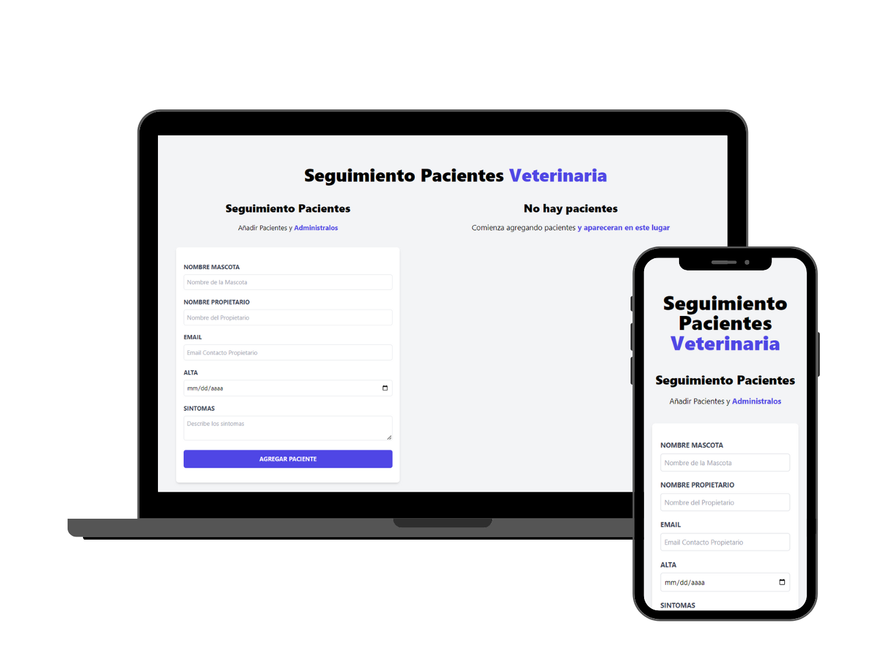

# 🐶 PetCare Portal



## 📖 Project Description

PetCare Portal is a web application developed for veterinarians, allowing pet owners to input essential information about their pets. The project is built using React, Vite, and Tailwind CSS to provide a user-friendly and efficient experience.

## 💻 Installation

1. Clone the repository:

    ```bash
    git clone https://github.com/your-username/petcare-portal.git
    cd petcare-portal
    ```


2. Install dependencies:

    ```bash
    npm install
    ```

## 🏗️ Project Structure

```
petcare-portal/
|-- src/
|   |-- components/
|   |   |-- Form.jsx
|   |   |-- Error.jsx
|   |   |-- Formulario.jsx
|   |   |-- Header.jsx
|   |   |-- ListadoPacientes.jsx
|   |   |-- Paciente.jsx
|   |-- App.jsx
|   |-- index.jsx
|-- public/
|   |-- index.html
|-- README.md
|-- package.json
|-- vite.config.js
```

## 🛠 Technologies Used
 


## 📚 What I Learned
During the development of PetCare Portal, I learned and applied the fundamentals of React, including:
- **Components**: Creating and using reusable components.
- **Events**: Handling events in React to interact with the user.
- **State**: Managing the application's state.

## 📫 Contact Information
[](https://aimarbusta.netlify.app/)
[](https://www.linkedin.com/in/aimarbustamante/)
[](https://www.instagram.com/aimarbusta.dev/) 
[](mailto:aimarbustamante379@hotmail.com) 
[](https://wa.me/65167602) 
